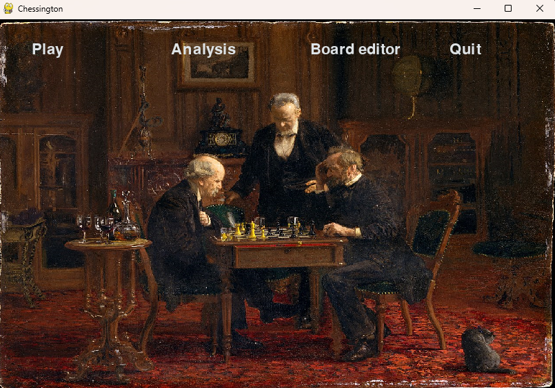
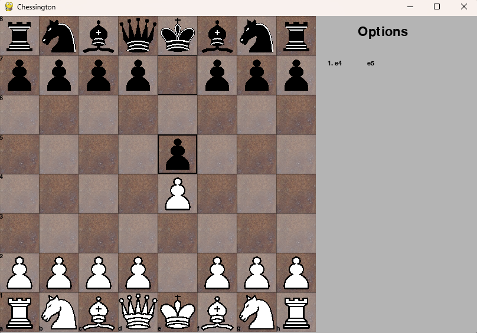
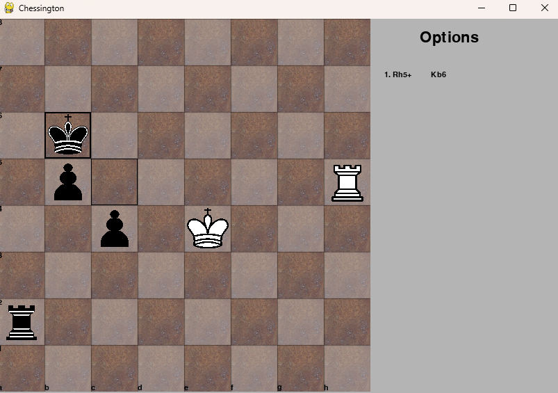

# **Chessington** 

Chessington is a chess-playing application made with pygame, using a chess minimax algorithm written in C++. 

To open the project, download the .zip file from the appropriate Release. 

## **Chessington:** 

- Allows to play a game against the embedded algorithm, Enginegton (see below).
- The user can explore different lines in Analysis, and set up their own positions and games in the Board Editor.
- The user interface supports piece-dragging. 
- The user can also navigate the analysis with arrow keys.
- The application is resizable.

### Future work: 

- Allowing the user to save games and analyses.
- Introducing time controls.
- Building Enginegton testing setup in the application.  

## **Enginegton:** 

### Features: 

- Implements a minimax algorithm to find a move in a given position. 
- Generates all legal moves for a position on Chessington's request. 
- Uses a piece-centric approach. 
- Optimised with alpha-beta pruning and zobrist-key-based transposition table. 
- Generates magic bitboards for pre-computed rook and bishop moves on Chessington start-up. 
- Currently, it processes an average of 180k-220k positions per second, with maximum search depths of 6-8. 

(To view the data from the most recent Enginegton search, go to "Enginegton2" directory in the download folder, and find "search_log.txt")

### Known issues and current design characteristics: 

1. Enginegton does not keep track of the game it plays and of any repeating positions during its search. Sometimes, this might lead to a repetition of moves, and given its relatively low search depth, to missing continuations for easily winning positions (example below). 

(In this position, if the user continues checking the Black king, played by Enginegton, the game will reach a threefold repetition and the user will be able to claim a draw)

The algorithm does not yet have these capabilities, and does not use an opening book, because it was developed to be used in Analysis or on positions built in the Editor, with the idea that it should perform the same regardless of the context in which it is called or the context of the chess position. 

2. Introducing new evaluation parameters without also modifying move-ordering parameters accordingly can result in a noticeable performance loss (move-ordering largely determines the efficacy with which the algorithm prunes branches of the search tree). For this reason, the evaluation is the least developed part of the algorithm. 

3. Issues (1) and (2) can have adverse effects on Enginegton's endgame play. On the other hand, the algorithm plays strongly in late middlegame positions.  

4. The algorithm is capped at 30 seconds; if the search runs longer than that, it stops and returns the best move found thus far, which sometimes results in making very dubious moves.
(However, in practice, it almost never crosses this threshold, even in very complex positions)

### Future work: 

1. Introducing iterative depening, to address issue (4) and enhance move-ordering. This will make the algorithm suited for different time controls. 
2. Improving the evaluation and move-ordering parameters.
3. Adding a game-tracking interface, to address issue (1) (this includes a persistent transposition table and move history). 
4. Introducing initial move-ordering, to be performed ahead of the search, to boost alpha-beta pruning. 
5. Making the Move struct more compact. 
6. Connecting Enginegton to lichess.org.

